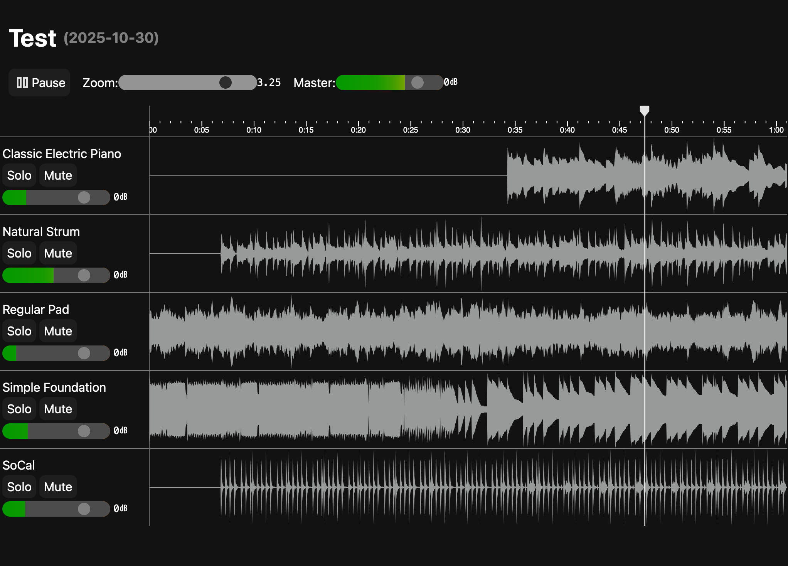
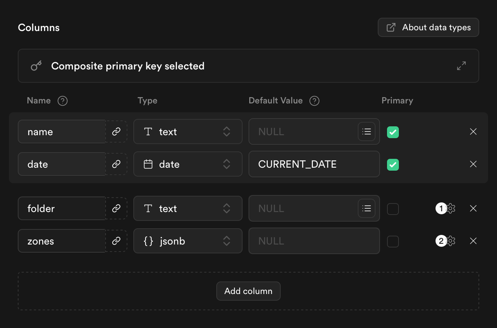
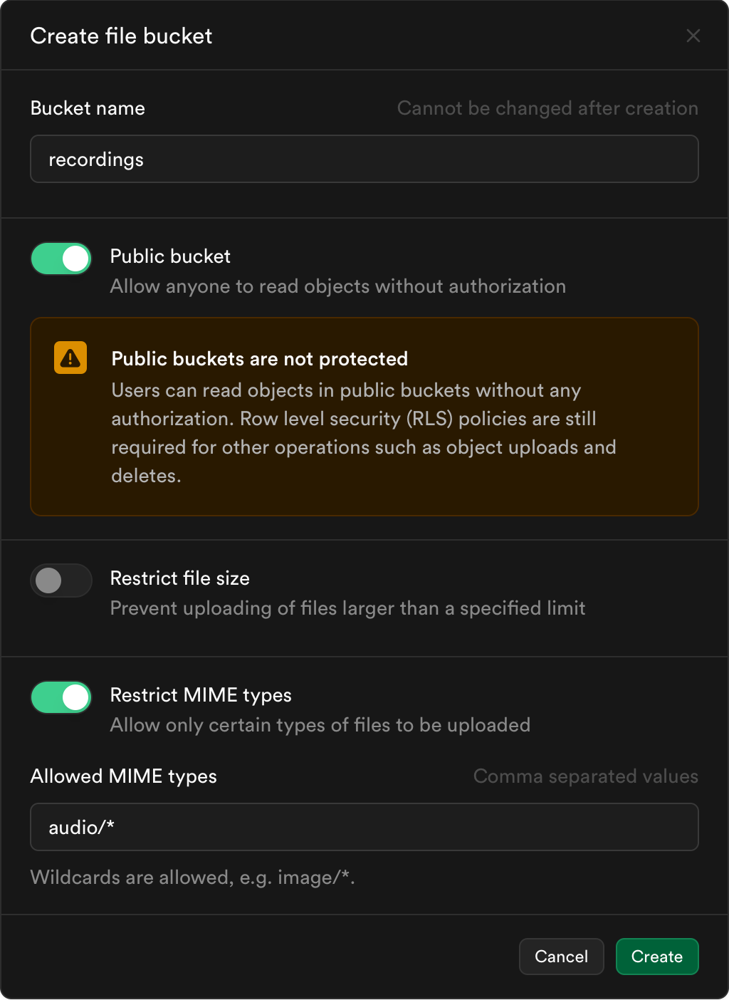
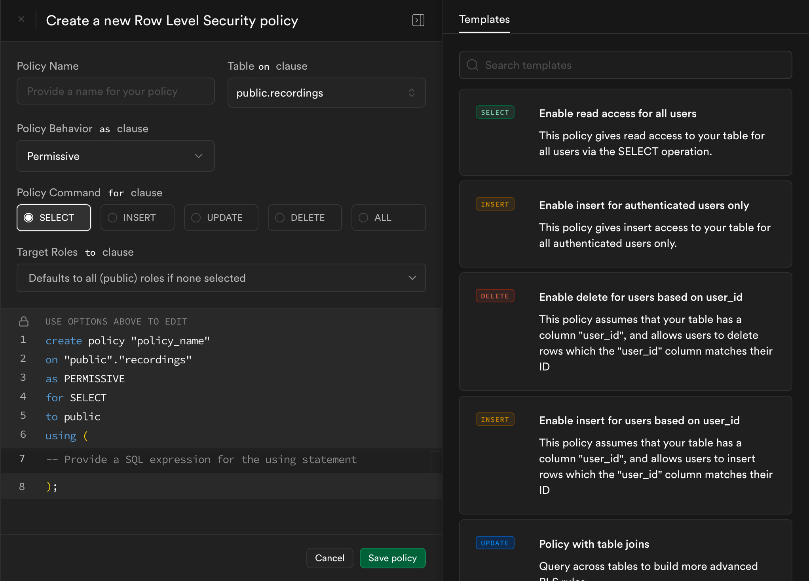
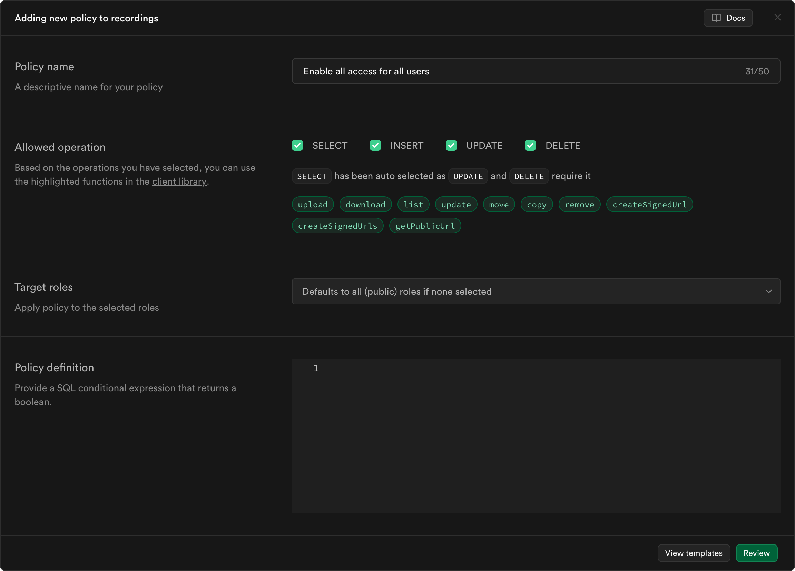

# Reperform

Play back a multitrack recorded performance in a browser using Supabase and Web Audio API with waveforms


## Features

- Auto-generated waveforms
- Playback Faders per-track
- Zoom with either slider or ctrl/cmd + wheel
- Some Logic Pro Keybinds (Space for pause/play, Enter to restart)

## Frontend Setup

`bun i && bun dev`

## Supabase Setup

1. Create a table named `recordings` with the following columns



  - folder should be Nullable
  - zones should be Nullable and Defined as Array

2. Create storage Bucket named `recordings` with the following settings



  - Note: On default supabase, there is a file size limit of 50mb I think. You will need to change it in your .env if self hosting
  - Public should be set based on your rls policies

3. Setup RLS policies

Table: Use "Enable read access for all users" or set to ALL for testing



  - Auth will be implemented soon

Bucket: Use the following template, or disable everything but select for all users



  - Auth will be implemented soon

4. Create a `.env` file based on `.env.example` and set the parameters
5. Alter policies after I add auth support

I wish supabase had templates

## Usage

- File name format `n=Name.ext`
  - Anything before `=` will be hidden, and can be used for sorting
  - Anything after the first `.` will also be hidden
- Tracksets are composited by Name + Date, so You will be prompted if those values are identical to one already existing
- Zones have the following type until I add a gui to create them:
```ts
interface Zone {
	name: string;
	start: number;
	end: number;
}
```
